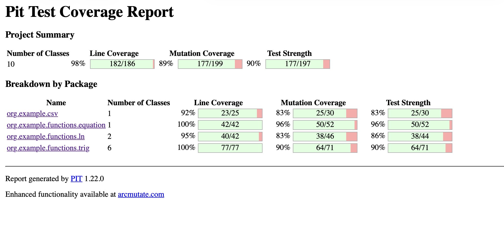
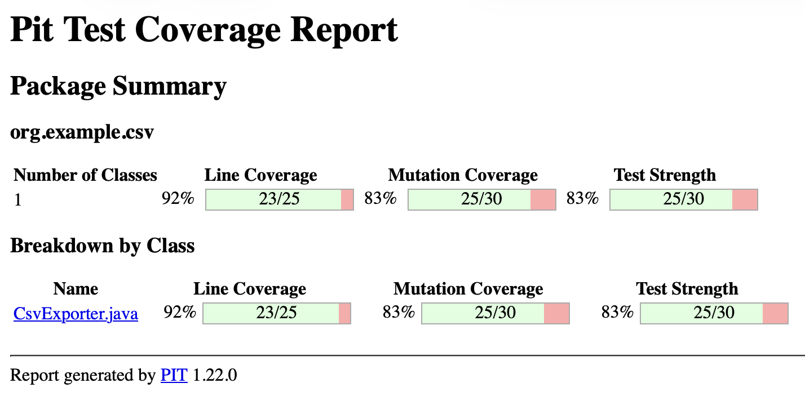
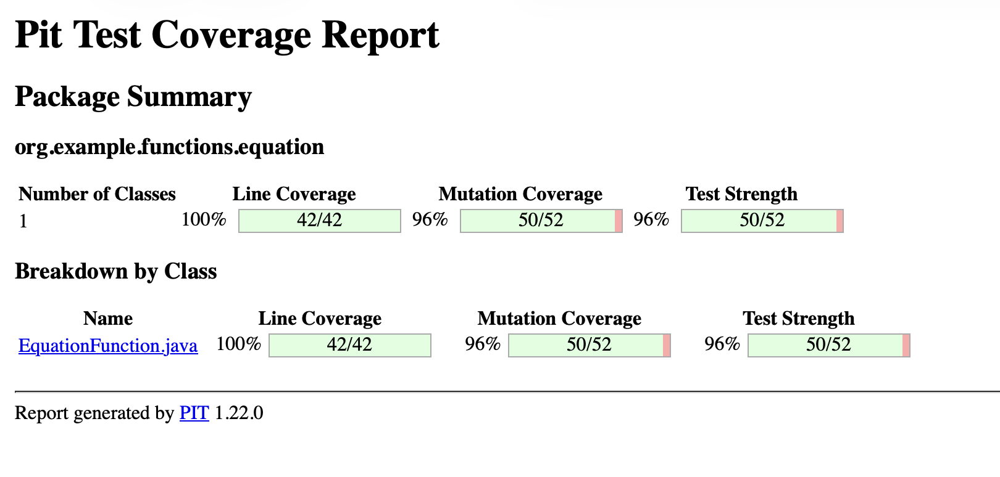
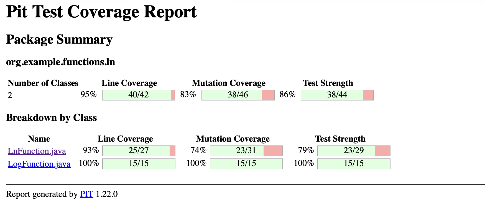
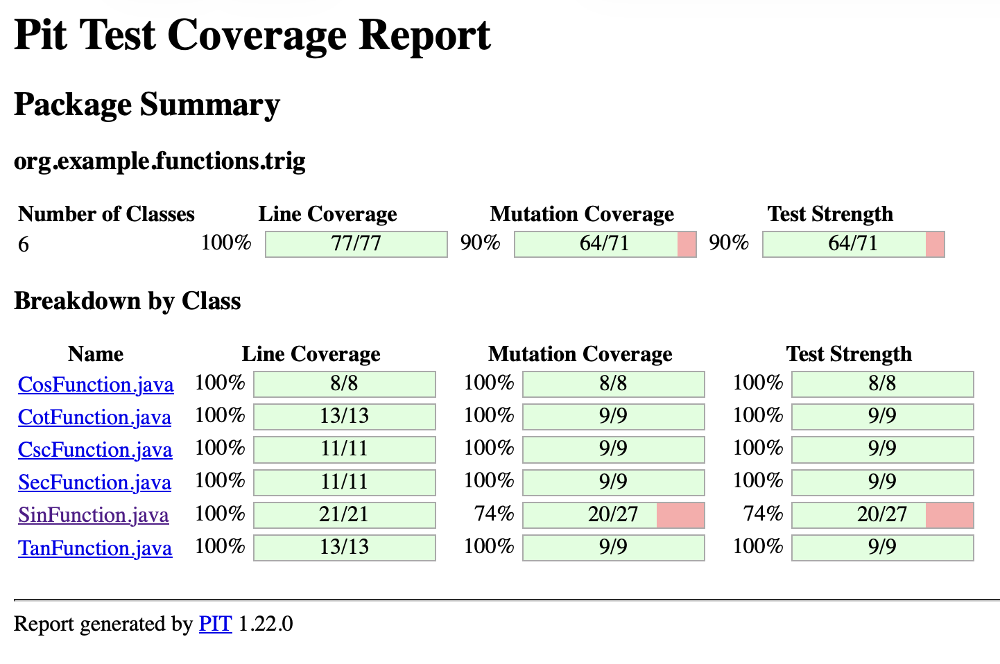
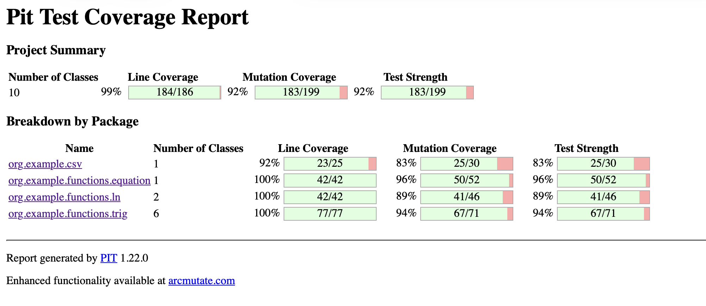
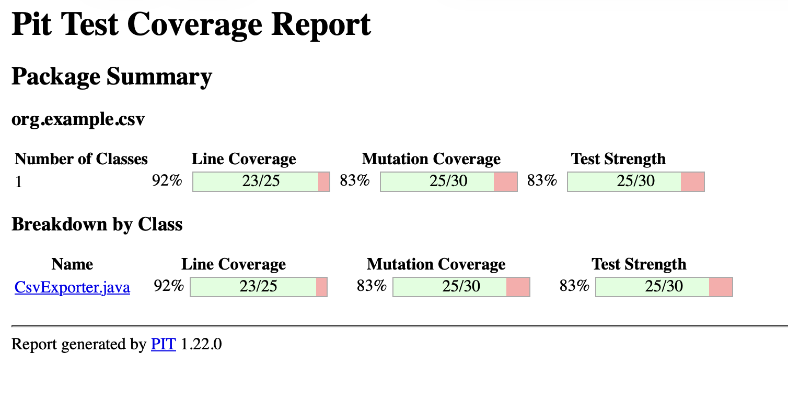
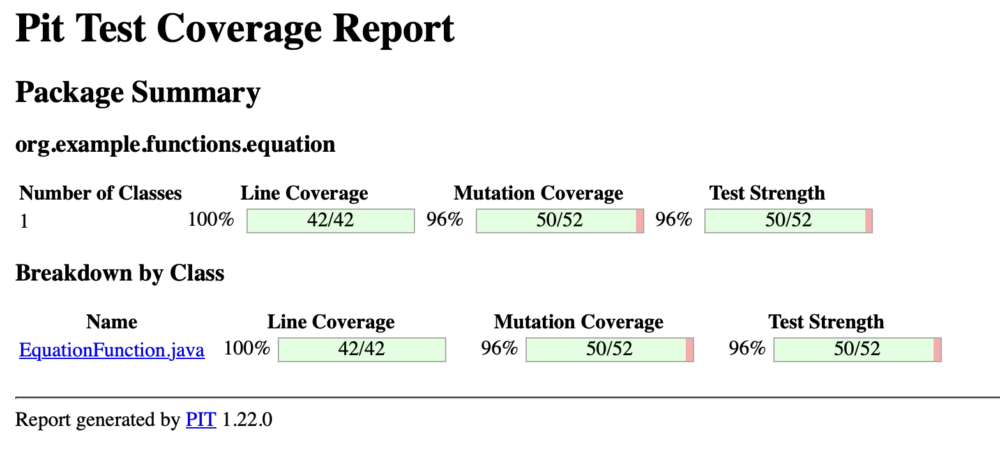
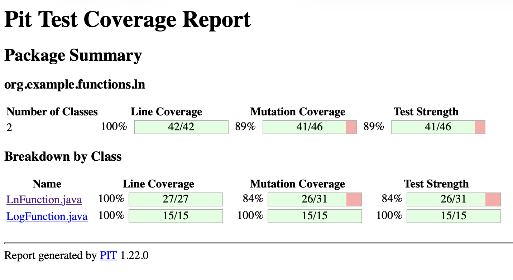
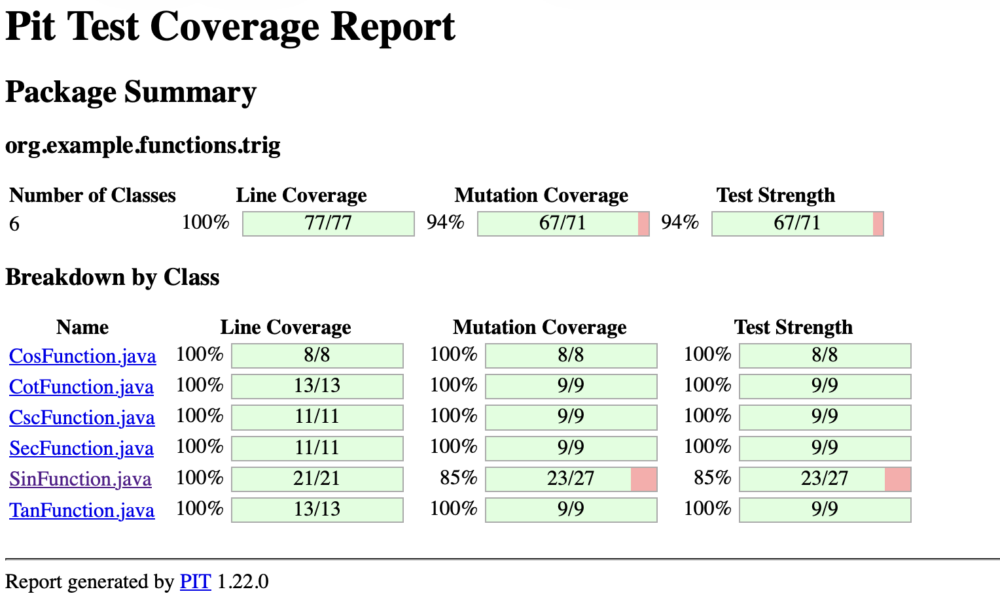

# Mutation Testing Report With PIT

### Результаты до исправлений
Общий:

org.example.csv:

org.example.functions.equation:

org.example.functions.ln:

org.example.example.function.trig:

### Исправления
Основные классы которые можно исправить - LnFunction и SinFunction
Для LnFunction необходимо добавить ветку проверки mantissa.
Для SunFunction необходимо добавить проверки при `x == accuracy`
После добавления тестов на мантиссу потребовалось заменить if на while.

### Результаты после исправлений
Общий:

org.example.csv:

org.example.functions.equation:

org.example.functions.ln:

org.example.example.function.trig:

